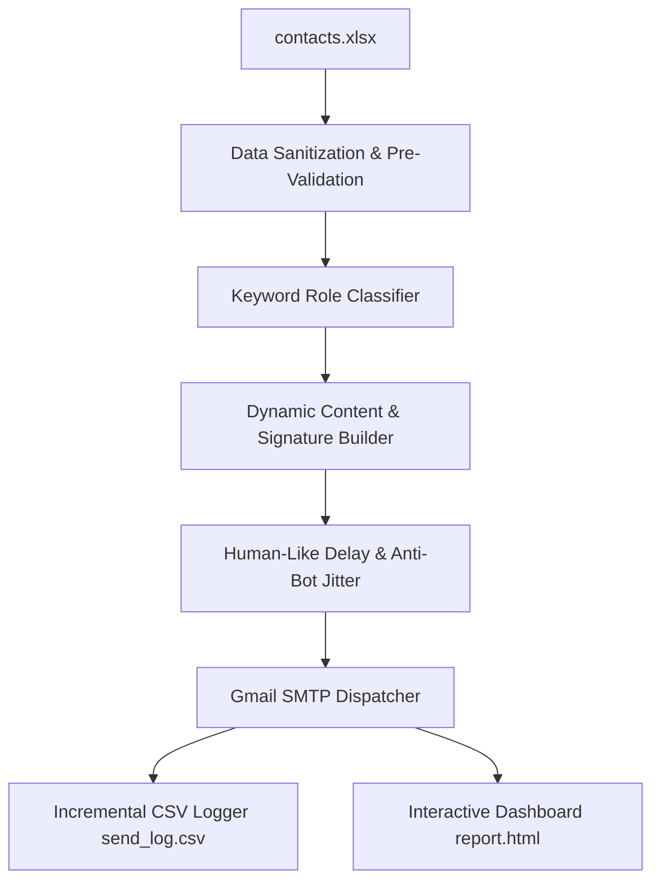

# 📧 HR Cold Email Automation System

An automated, intelligent, and recruiter-friendly email outreach system built with Python and Gmail SMTP. 

It reads recruiter contacts from Excel, analyzes job roles to dynamically match skills and projects, personalizes greetings and locations, attaches resumes, and sends cold emails safely using anti-spam deliverability protections.

---

## 📑 Table of Contents
1. [Architecture & How It Works](#-architecture--how-it-works)
2. [Core Features](#-core-features)
3. [Project Structure](#-project-structure)
4. [Quick Setup & Installation](#-quick-setup--installation)
   - [1. Prerequisites](#1-prerequisites)
   - [2. Generate Gmail App Password](#2-generate-gmail-app-password)
   - [3. Configure Environment Variables](#3-configure-environment-variables)
   - [4. Prepare Excel Contacts & Resume](#4-prepare-excel-contacts--resume)
5. [Usage & CLI Commands](#-usage--cli-commands)
   - [Dry Run (Preview Mode)](#1-dry-run-preview-mode)
   - [Self-Test Mode (Send Sample to Yourself)](#2-self-test-mode-send-sample-to-yourself)
   - [Live Outreach Mode](#3-live-outreach-mode)
   - [Analytics & Stats](#4-analytics--stats)
6. [Interactive Web Dashboard (`report.html`)](#-interactive-web-dashboard-reporthtml)
7. [Deliverability & Anti-Spam Protections](#-deliverability--anti-spam-protections)
8. [Troubleshooting & FAQs](#-troubleshooting--faqs)

---

## ⚙️ Architecture & How It Works



1. **Excel Parsing & Pre-Filtering**: Loads recruiter contacts, normalizes email strings, discards invalid/disposable domains, and automatically strips duplicate records.
2. **Dynamic Role Mapping**: Scans the target `Role` column using word-boundary pattern matching to assign the most relevant category (`ai_ml`, `data`, `backend`, `frontend`, `devops`, or `default`).
3. **Smart Personalization**:
   - Extracts the recipient's first name for a natural greeting (`Hi Pooja,` instead of `Hi Pooja Sharma,`).
   - Cleans cluttered company names and multi-role strings.
   - Adds customized on-site or relocation sentences based on the target city.
4. **Deliverability Engine**: Dispatches emails with randomized jitter delays (12s–25s) and cooldown breaks to prevent bot-detection flags by Google.
5. **Crash-Safe State Tracking**: Writes delivery outcomes immediately to `send_log.csv` and compiles live metrics into an interactive dashboard (`report.html`).

---

## ✨ Core Features

| Module | Capability |
|---|---|
| 🧠 **Dynamic Role Matching** | Automatically tailors technical skills, internship achievements, and projects depending on whether the role is AI/ML, Data Engineering, Backend, Frontend, or DevOps. |
| 🛡️ **Anti-Spam Human Jitter** | Non-fixed delays (12s–25s) + periodic batch rest pauses prevent Google SMTP throttling and maintain high domain deliverability. |
| 👤 **First-Name Extraction** | Converts full names and formal titles into friendly greetings (`Hi Rohit,`) and handles missing names cleanly (`Hi there,`). |
| 📍 **Smart Location Match** | Dynamically appends relocation / remote availability tailored to the recruiter's job location. |
| 🚫 **Duplicate Prevention** | Persistently tracks all previously emailed recruiters in `send_log.csv` to ensure no contact receives duplicate messages. |
| 📊 **Interactive Web UI** | Generates a standalone web dashboard (`report.html`) equipped with instant search and status filters. |
| 🎛️ **Command-Line Interface** | Full CLI flag support (`--dry-run`, `--test`, `--send`, `--stats`) eliminating the need to modify source code between runs. |
| ✍️ **Dash-Free Copy Guard** | Em dashes, en dashes and double hyphens are the strongest tell that a cold email was machine-written. `assert_no_dashes()` checks every subject and body before it is handed to SMTP, and `soften_dashes()` rewrites them out of spreadsheet cells first, so a messy `company` value cannot leak one into a subject line. Hyphenated names like Coca-Cola are left alone. |
| 🔗 **Proof Links Per Role** | Each role category carries the one URL most worth opening for that kind of job: the DocMinds repo for AI/ML and data roles, the live RouteOS demo for backend and frontend, the RouteOS source for DevOps. The signature always carries portfolio, GitHub, LinkedIn, Codeforces and LeetCode. |

---

## ✉️ What the emails say

Every claim in the templates is on the résumé with the number that backs it, so a
recruiter who forwards the mail to an engineer finds the same facts in the PDF and
on the portfolio. Nothing is padded with tools that are not in the skills section.

The structure is fixed because recruiters decide in the first two lines:

1. **Opening** names the role and company, who I am, and that I want the job. No
   weather-talk preamble.
2. **Evidence** gives the internship result, then a project result, both with
   numbers (93% face verification accuracy, 20 to 35% distance reduction).
3. **Proof link** points at something running, chosen by role category.
4. **Stack line** lists only what the résumé lists.
5. **Ask** requests one specific thing, a short call or a pointer to the right
   person, and offers to take a screen or a task.

The follow-up, sent seven days later, deliberately offers an exit: if the role is
filled, a one-line reply is invited so the thread closes instead of going stale.

To change any of it, edit `ROLE_CATEGORIES` and `build_email_body()` in
`send_hr_emails.py`, then run `python send_hr_emails.py --dry-run 5` to read the
output before anything is sent.

---

## 📁 Project Structure

```text
hr_emails/
├── send_hr_emails.py             # Main automation script & logic
├── contacts.xlsx                 # Input Excel sheet containing recruiter contacts
├── Resume_Gajendra_Dhanoliya.pdf # PDF resume attached to outgoing emails
├── send_log.csv                  # Persistent ledger of sent/failed contacts
├── report.html                   # Interactive browser dashboard (auto-generated)
├── README.md                     # Documentation
└── .gitignore                    # Environment & cache ignore rules
```

---

## 🛠️ Quick Setup & Installation

### 1. Prerequisites
- **Python 3.8+** installed on your system.
- Required dependency:
  ```bash
  py -m pip install openpyxl
  ```

---

### 2. Generate Gmail App Password
Google requires a dedicated 16-character **App Password** to securely connect via SMTP:

1. Enable **2-Step Verification** on your Google Account: [Google Account Security](https://myaccount.google.com/signinoptions/two-step-verification).
2. Generate an App Password: [Google App Passwords](https://myaccount.google.com/apppasswords).
3. Name it `HR Outreach` and copy the generated **16-character string** (e.g. `abcd efgh ijkl mnop`).

---

### 3. Configure Environment Variables
Set the App Password in your terminal session:

**Windows (Command Prompt):**
```cmd
setx HR_MAIL_APP_PASSWORD "your_16_character_password"
```
*(Restart your Command Prompt window after running `setx`).*

**macOS / Linux:**
```bash
export HR_MAIL_APP_PASSWORD="your_16_character_password"
```

---

### 4. Prepare Excel Contacts & Resume
Place your recruiter spreadsheet as `contacts.xlsx` in the project root directory.

**Required Excel Column Headers:**
- `company` — Company name (e.g., *Google*, *Droom*, *TCS*)
- `Role` — Job title (e.g., *Software Engineer*, *Data Analyst*, *AI Intern*)
- `Experience` — Experience requirement (e.g., *0-1 years*, *Freshers*)
- `Location` — Job location (e.g., *Bengaluru*, *Noida*, *Remote*)
- `email` — Recruiter's email address
- `name` — Recruiter's name or title

---

## 🚀 Usage & CLI Commands

All operations can be managed directly via terminal flags without editing Python files:

### 1. Dry Run (Preview Mode)
Simulates the entire workflow, generates email previews in the terminal, maps categories, and produces `report.html` **without sending any real emails**:
```bash
py send_hr_emails.py --dry-run 5
```

---

### 2. Self-Test Mode (Send Sample to Yourself)
Generates a personalized template from the first available contact and **dispatches it directly to your own inbox** (`SENDER_EMAIL`) to verify formatting, PDF attachments, and signature rendering on mobile/desktop:
```bash
py send_hr_emails.py --test
```

---

### 3. Live Outreach Mode
Dispatches personalized emails to recruiters in controlled batches:

```bash
# Send next 20 contacts
py send_hr_emails.py --send 20

# Send next 50 contacts
py send_hr_emails.py --send 50
```

---

### 4. Analytics & Stats
View summary metrics and total emails sent today against Gmail's quota without processing contacts:
```bash
py send_hr_emails.py --stats
```

---

## 📊 Interactive Web Dashboard (`report.html`)

Every execution compiles results into a standalone HTML dashboard. Open `report.html` in any web browser to access:

- **Instant Search**: Filter by company name, email, candidate name, or job role in real-time.
- **Status Filter**: Toggle between `All`, `Sent`, `Failed`, and `Dry Run` records.
- **Category Analytics**: Review the distribution of emails sent across various technical domains.

---

## 🛡️ Deliverability & Anti-Spam Protections

To keep email deliverability high and protect accounts from spam penalties:

1. **Daily Volume Limits**: Gmail restricts free accounts to **500 emails/day** on a rolling 24-hour window. The script enforces a built-in safety ceiling at **450 emails/day**.
2. **Humanized Delivery Intervals**: Emails are spaced out using randomized 12s–25s delays with 90-second batch pauses every 30 emails.
3. **Persistent Logging**: Every successful send is written immediately to `send_log.csv`, ensuring zero duplicate emails across multiple runs.
4. **Delivery Window Best Practices**: Sending during business hours (Tuesday–Thursday, 9:30 AM – 5:30 PM) produces the highest response and open rates.

---

## ❓ Troubleshooting & FAQs

#### `ERROR: Gmail authentication failed`
- Confirm that **2-Step Verification** is active and you are using a generated **16-character App Password** (not your standard account password).

#### `ERROR: Resume not found`
- Verify that the PDF filename in the project directory matches `RESUME_PATH` configured in `send_hr_emails.py`.

#### `Daily limit reached`
- Free Gmail accounts reset their 500-email sending quota over a rolling 24-hour period. Wait for the window to clear before initiating new batches.

---

## 📄 License
This project is open-source and available under the [MIT License](LICENSE).
